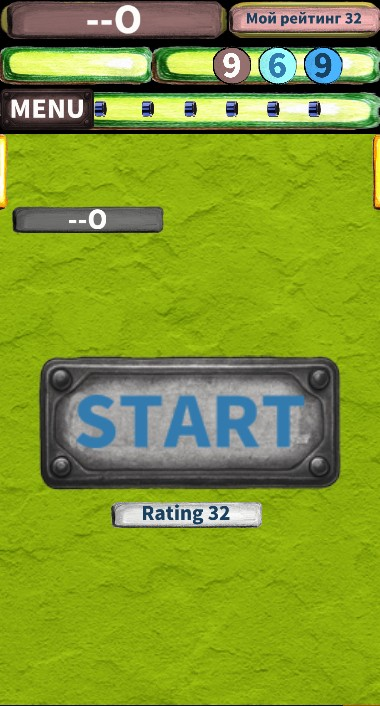
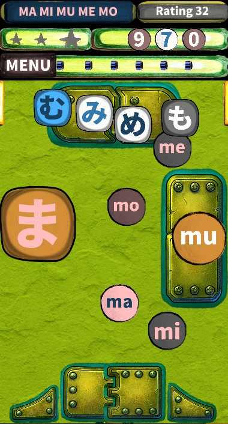
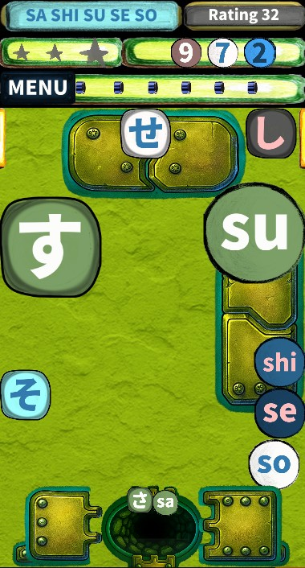
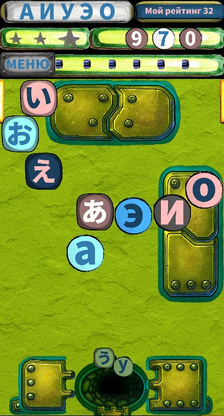
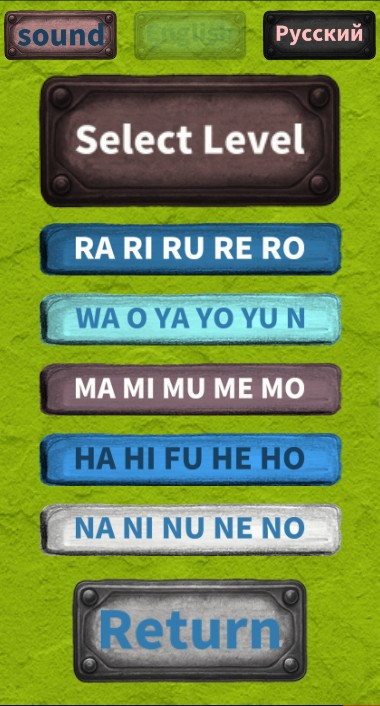
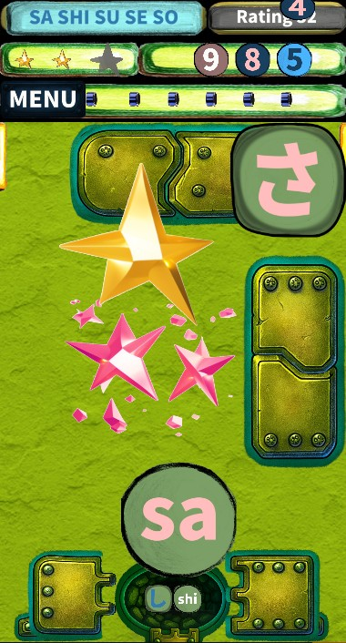

# Hiragana_learning_app
Application description: Extensible gamified learning application for diverse study materials, currently deployed with a specialized module for Japanese Hiragana, developed using Python and the Kivy framework.

Roadmap & Expansion: Currently features a fully functional Hiragana module, with scheduled rollouts for Katakana, Kanji, and alphabets of other foreign languages.

Key Accomplishments: Independently developed the platform from scratch for Android and successfully published it on Google Play, with an iOS release in the planning pipeline.

The application helps users retain information through an intuitive interface featuring visual elements, audio accompaniment, and an optimized, smart delivery system that adapts to the user's learning progress.

Key Features:
- Interactive Learning
- Adaptive Content Delivery: Smart system adjusting material selection based on personal performance.
- Gamified Exercises: Learning mechanics reinforced through game-based challenges.
- Image-Based Training: Visual learning elements to enhance memory retention.
- Audio Accompaniment: High-quality sound support for accurate pronunciation guide.
- User Progress Tracking: Automatic saving and monitoring of individual learning milestones.
- Multilingual Interface
- Variable Difficulty Levels
- Versatile Core Architecture: Highly adaptable codebase engineered for easy expansion to other subjects.

Technology:
#### Python
Built the core application logic using advanced Object-Oriented Programming (OOP) principles.
Engineered a subject-agnostic adaptive learning algorithm and progress-tracking data models, designed to support any training material beyond Hiragana.
C Kivy
Developed a responsive, cross-platform interface supporting interactive animations, such as moving clickable and draggable elements.
Implemented custom UI components to handle dynamic, multilingual text layouts and on-the-fly image rendering.

#### Pillow
#### NumPy
#### JSON
#### Regular expressions
#### Multithreading
#### Git / GitHub

### Android Development & Deployment:
Build Tools: Buildozer, Python-for-Android (p4a).
Debugging & Testing: ADB (Android Debug Bridge), Logcat analysis, Google Play Internal Testing.
Release & Publishing: Keystore management & application signing, Android App Bundle (AAB) generation, Google Play Console deployment.

The application has been successfully built and tested for:
- Android API 36
- 16 KB memory page-size compatibility

 #### ------------------------------------------------------------------------------------------------------------

###  Development Process

The project was developed entirely from scratch by a single developer and covered the full Software Development Life Cycle (SDLC).

#### Architecture Design
Designed the overall application architecture with a focus on modularity, maintainability and extensibility, allowing the learning system to be adapted to additional educational subjects.

#### UI/UX Implementation
Developed an adaptive and interactive user interface using custom Kivy layouts and animations .

#### Algorithm Development
Designed and implemented the core educational logic, including a universal subject-independent adaptive learning algorithm.

#### Media Processing
Integrated dynamic image processing using the Pillow library and audio playback functionality.

#### Data Storage
Implemented local storage of user progress and localization data using JSON.

#### Mobile Application Build
Configured and managed the Android build process using Buildozer and python-for-android. Worked in both a dedicated Ubuntu virtual machine and Windows Subsystem for Linux (WSL).

#### Testing and Debugging
Performed extensive runtime testing and debugging using ADB and Android Logcat to identify and resolve application issues and ensure stable operation on mobile devices.

#### Deployment and Release
Managed the application release process through Google Play Console, including application signing with a keystore, configuration of internal testing tracks, and generation of release Android App Bundles (AAB).

#### -------------------------------------------------------------------------------------------------------------- 

#### Source Code Policy
This project is closed-source. This public repository serves exclusively as a portfolio showcase, featuring the project overview, architectural breakdown, screenshots, and demonstration materials.

## Google Play

The application is available on Google Play:

[View the application on Google Play](https://play.google.com/store/apps/details?id=com.amimon.aam.app_63_aab)

#### -------------------------------------------------------------------------------------------------------------- 

Author:
Independent software development project.
Developed in Japan.

## Screenshots

<table>
  <tr>
    <td></td>
    <td></td>
    <td></td>
  </tr>
  <tr>
    <td></td>
    <td></td>
    <td></td>
  </tr>
</table>
