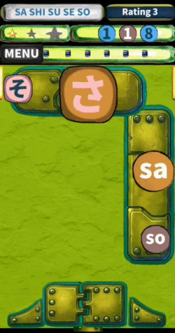

# Hiragana learning app

<table>
  <tr>
    <td width="60%" valign="top">

## Overview: 
Extensible gamified learning application for diverse study materials, currently deployed with a specialized module for Japanese Hiragana, developed using Python and the Kivy framework.

The application helps users retain information through an intuitive interface featuring visual elements, audio accompaniment, and an optimized, smart delivery system that adapts to the user's learning progress.

[View at Google Play](https://play.google.com/store/apps/details?id=com.amimon.aam.app_63_aab)
    </td>
    <td width="40%" align="center" valign="top">
      
    </td>
  </tr>
</table>

---

## Features

* **Adaptive Content Delivery:** Smart algorithm adjusting material selection based on personal performance.
* **Gamified Exercises:** Interactive game-based challenges.
* **Multisensory Training:** High-quality audio guides for accurate pronunciation combined with visual (image-based) elements to enhance memory retention.
* **User Progress Tracking:** Saving and monitoring of individual learning milestones.
* **Multilingual Interface:** 
* **Versatile Core Architecture:** Subject-agnostic codebase engineered for seamless expansion to other subjects (Katakana, Kanji, and foreign alphabets).

## Tech & Development

### Technologies

* **Python & OOP:** Built the application logic utilizing advanced Object-Oriented Programming principles to ensure scalability.
* **Kivy Framework:** Developed a responsive, cross-platform UI supporting interactive animations, moving/clickable layouts, and custom draggable elements.
* Pillow
* NumPy
* JSON
* Regular expressions
* Multithreading
* **Version Control:** Managed via **Git / GitHub**.

### Building & Launching Android Apps
* **Build Tools:** Buildozer, Python-for-Android (p4a).
* **Debugging & Testing:** ADB (Android Debug Bridge), Logcat analysis, Google Play Internal Testing.
* **Release & Publishing:** Keystore management & application signing, Android App Bundle (AAB) generation, Google Play Console deployment.

## Development Process

### Architecture Design
Built with a modular design. The core flashcard engine is independent of the Japanese language, so the app can easily work with any other subject or educational content.

### Roadmap & Expansion: 
Currently features a fully functional Hiragana module, with scheduled rollouts for Katakana, Kanji, and alphabets of other foreign languages.

### Key Accomplishments: 
Independently developed the Android app entirely from scratch and launched it on Google Play. Plans for an iOS release are underway.

### Android Development & Deployment:

The application has been successfully built and tested for:
- Android API 36
- 16 KB memory page-size compatibility

### Media Processing
Integrated dynamic image processing using the Pillow library and audio playback functionality.

### Data Storage
Implemented local storage of user progress and localization data using JSON.

### Testing and Debugging
Performed extensive runtime testing and debugging using ADB and Android Logcat to identify and resolve application issues and ensure stable operation on mobile devices.

### Deployment and Release
Managed the application release process through Google Play Console, including application signing with a keystore, configuration of internal testing tracks, and generation of release Android App Bundles (AAB).

### Source Code Policy
This project is closed-source. This public repository serves exclusively as a portfolio showcase, featuring the project overview, screenshots, and demonstration materials.

* **Google Play**

The application is available on Google Play:

[View the application on Google Play](https://play.google.com/store/apps/details?id=com.amimon.aam.app_63_aab)

---
* **Author:**
Independent software development project.
Developed in Japan.

## Screenshots

<table>
  <tr>
    <td></td>
    <td></td>
    <td></td>
  </tr>
  <tr>
    <td></td>
    <td></td>
    <td></td>
  </tr>
</table>
